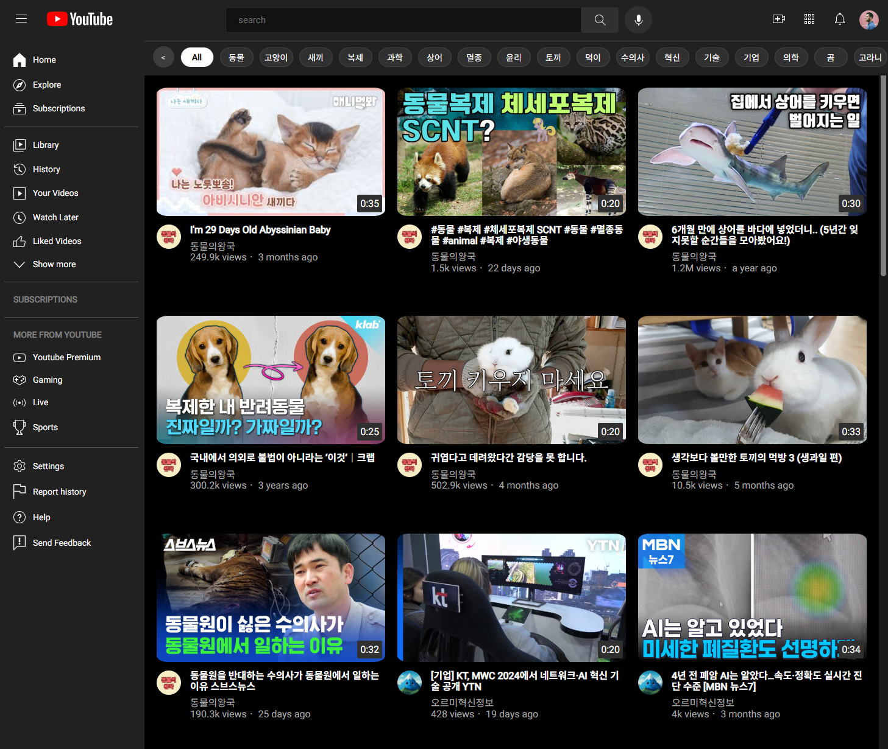
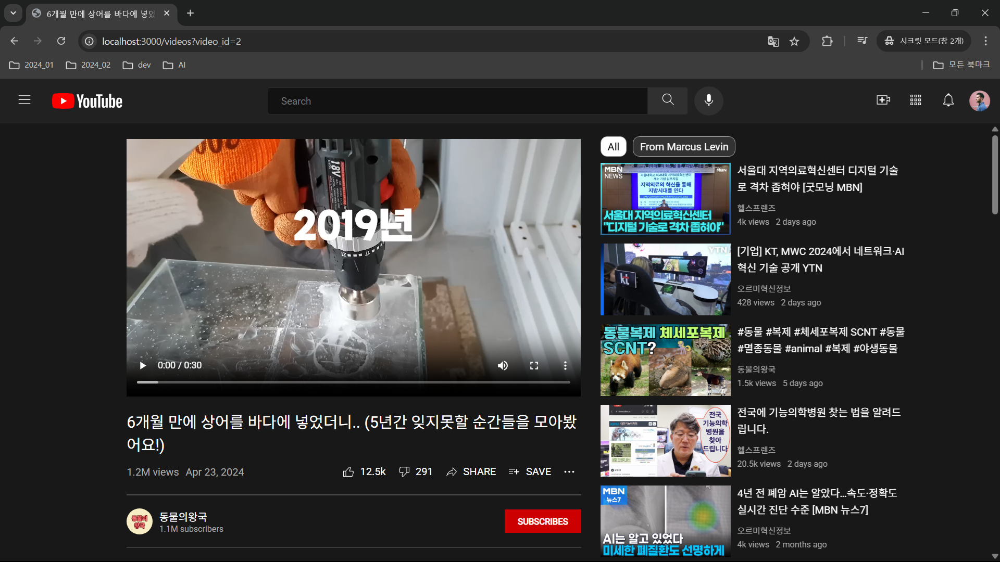

# 유튜브 클론 프로젝트

**이스트소프트 백엔드 과정 오르미 11기**  
팀 프로젝트 : YouTube 클론 사이트 제작

---

## 팀 구성원

- (팀장) 허준 ([JunHur97](https://github.com/JunHur97))
- 김예은 ([yeeunkim7](https://github.com/yeeunkim7))
- 신동규 ([renetdevp](https://github.com/renetdevp))
- 이수완 ([SooowanLee](https://github.com/SooowanLee))

---

## 진행사항

| 일자       | 김예은                                 | 신동규                             | 이수완                                | 허준                                 |
| ---------- | -------------------------------------- | ---------------------------------- | ------------------------------------- | ------------------------------------ |
| 2025-04-22 | 상단바 html 개발 (html/상단바3개.html) | nav바 html 개발 (html/navBar.html) | 상단바 css 개발 (css/headerStyle.css) | nav바 css 개발 (css/navBarStyle.css) |
|2025-04-23|video 페이지 개발중|video page 개발중 (videoMain / videoNav / videoPage / videoComment / recommendedVideo.ejs)|main page 개발중 (main/mainContent.ejs)|channel page 개발중|

## 실행

### 개발 환경 설정
```
npm i
node app
```
### 메인 페이지
```
http://localhost:3000
```


### 영상 페이지
```
id: Number
http://localhost:3000/video?video_id={id}
```

